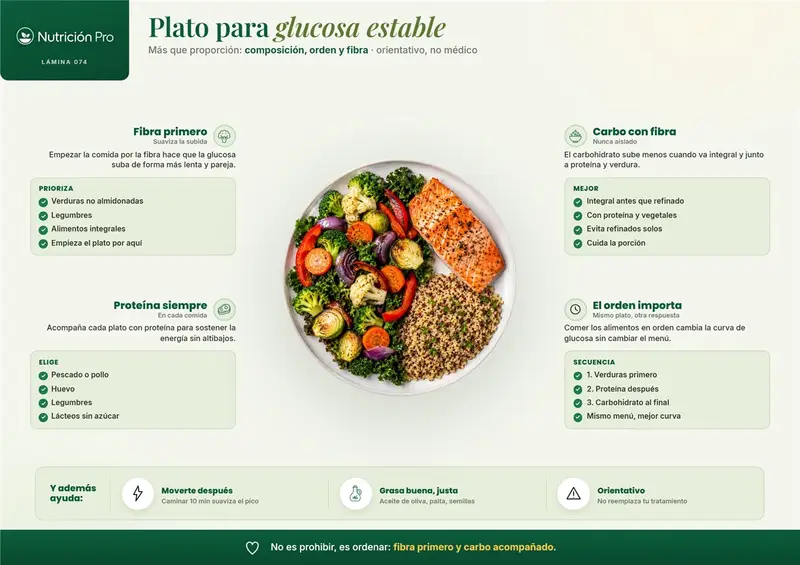
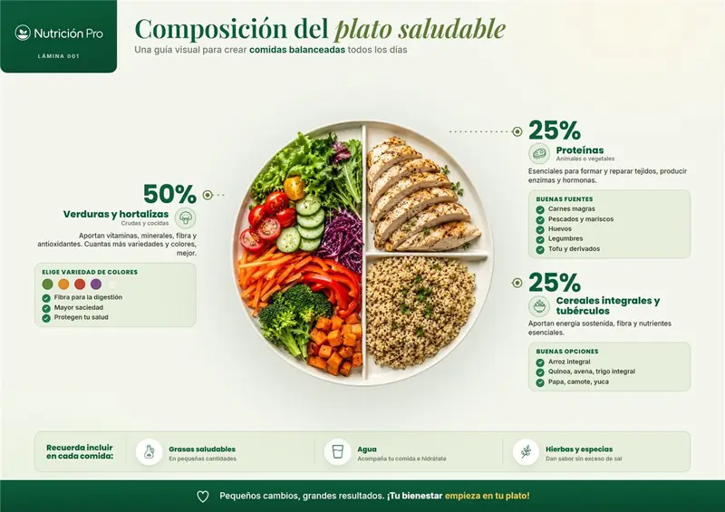
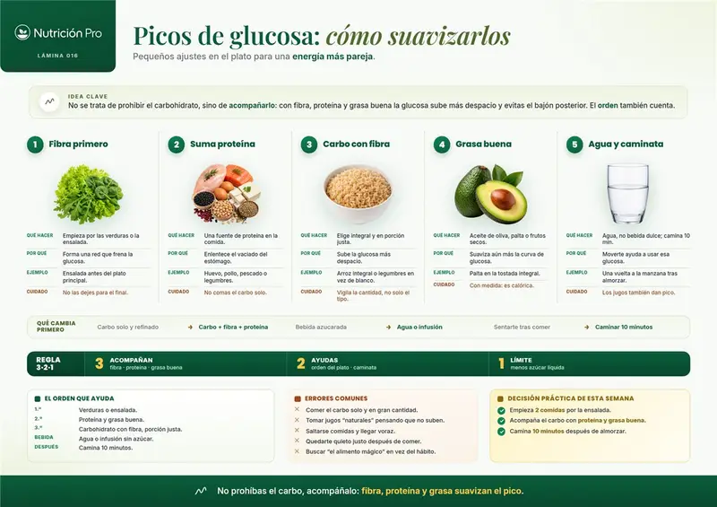
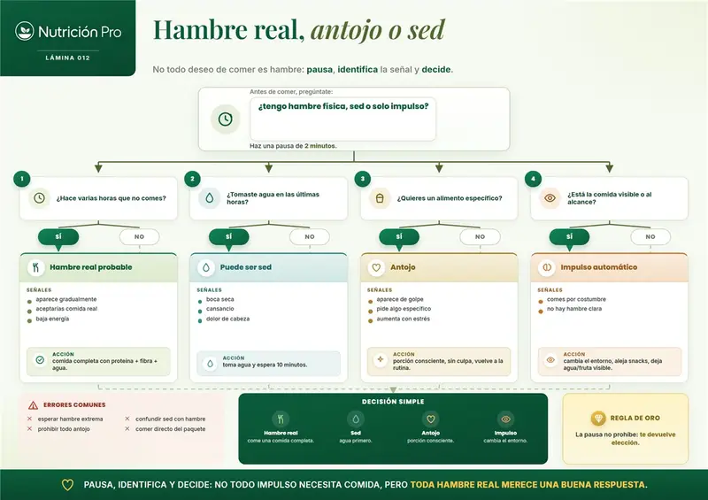
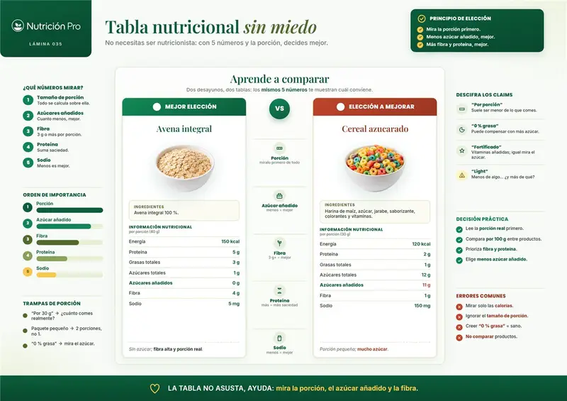
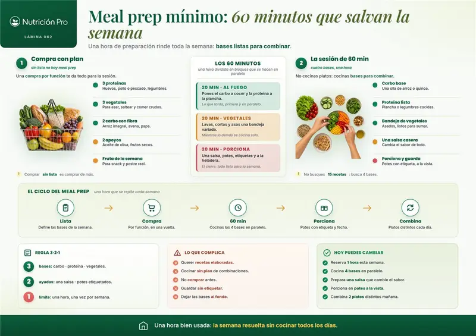
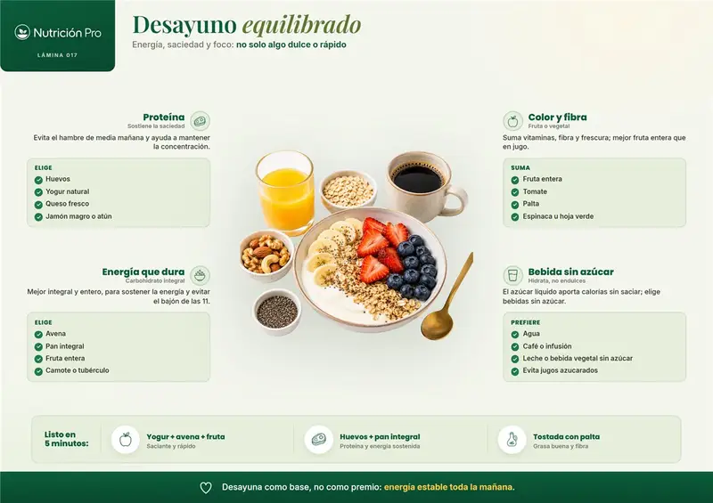
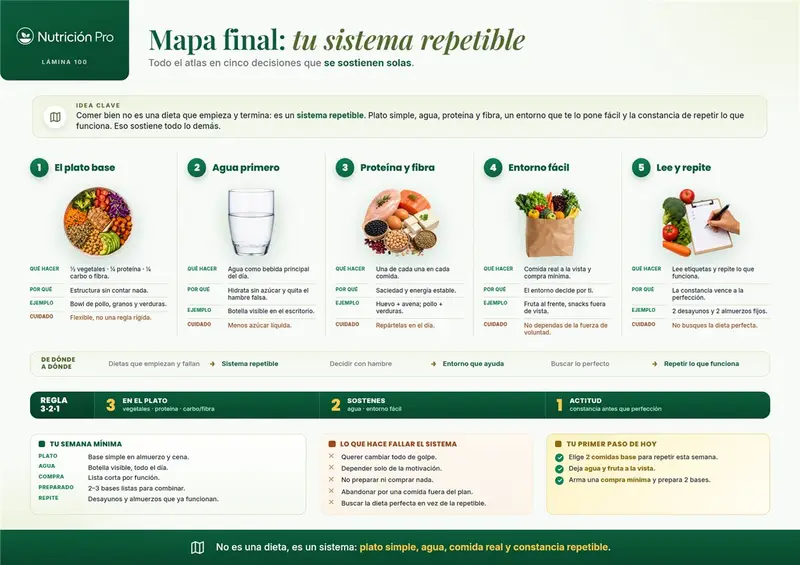
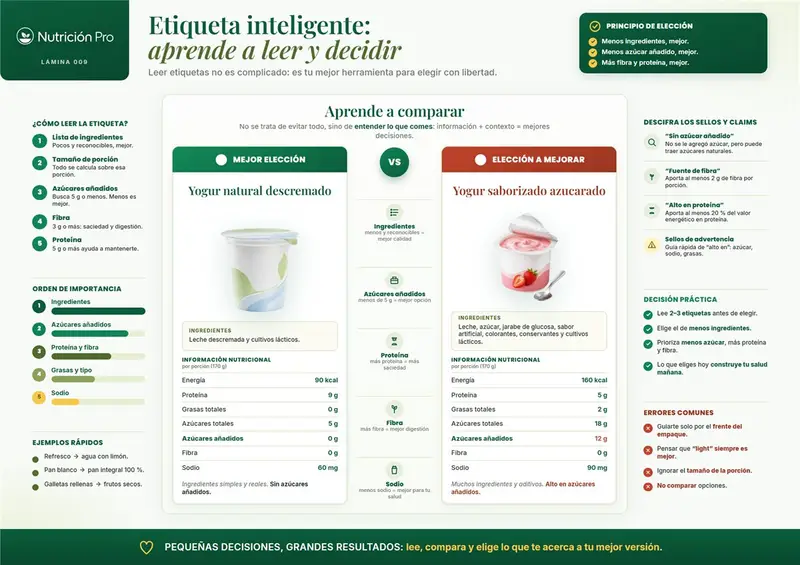
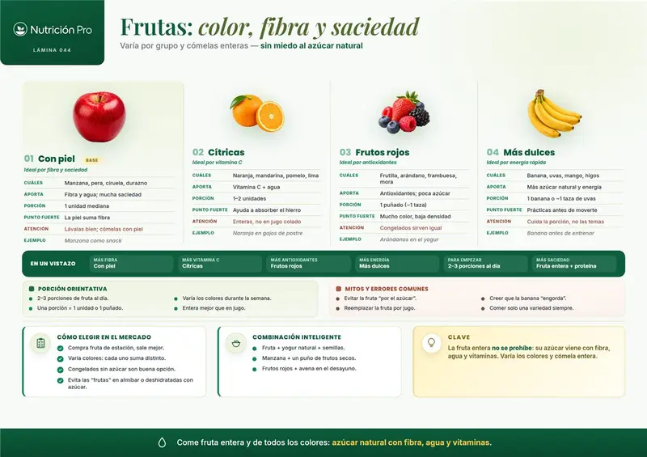

# Referencia visual interna — Atlas Nutrición Pro

## Condición de uso

Capturas aportadas por Matías para investigación e inspiración interna. Pertenecen a su fuente original y **no son assets publicables de MatiOS**. No copiar marca, texto, fotografía ni composición exacta. Usarlas para recordar el principio que buscamos: una idea impactante, simple, visual y accionable.

Fuente: <https://atlasnutricionpro.com/>

## Índice y aprendizaje visual

### 1. Plato para glucosa estable

**Rescatar:** alimento central + cuatro principios alrededor + cierre memorable.

### 2. Composición del plato

**Rescatar:** proporciones dibujadas sobre el alimento y alternativas inmediatamente visibles.

### 3. Picos de glucosa

**Rescatar:** secuencia numerada, regla resumida y decisión de esta semana.

### 4. Hambre, antojo o sed

**Rescatar:** convertir un concepto abstracto en preguntas y caminos; MatiOS debe evitar categorías rígidas.

### 5. Tabla nutricional

**Rescatar:** dos productos comparables, diferencias señaladas y criterio visible en lugar de números aislados.

### 6. Meal prep mínimo

**Rescatar:** tiempo limitado, trabajo paralelo, ciclo completo y acción concreta.

### 7. Desayuno equilibrado

**Rescatar:** una escena alimentaria deseable rodeada de componentes sustituibles.

### 8. Sistema repetible

**Rescatar:** pasar de dieta a sistema, mostrar cinco decisiones y cerrar con el primer paso de hoy.

### 9. Etiqueta inteligente

**Rescatar:** combinar frente, ingredientes, tabla, claims y decisión práctica.

### 10. Frutas, color y fibra

**Rescatar:** categorías visuales, comparación rápida y combinaciones aplicables.

## Regla para el futuro diseño

Cada pieza original de MatiOS debe conservar como máximo:

1. una idea central;
2. una visual dominante;
3. tres a cinco decisiones;
4. un error o matiz importante;
5. una acción para hoy;
6. acceso opcional a profundidad y fuentes.

La versión móvil divide estas capas en componentes verticales; nunca reduce la lámina completa hasta volverla ilegible.
